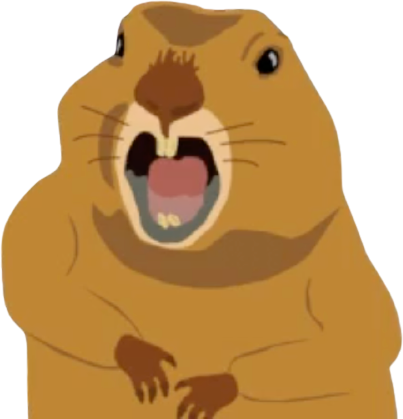

# gophers OBS overlay

a gopher game overlay for OBS, for [rosco](https://www.twitch.tv/roscomcc)

## using in OBS

there's two ways, using the online link or downloading. downloading the files will be more reliable as you won't need to download anything on the fly and if the website goes down it will 100% work. the downside to downloading is you'll need to download each time.

both options use the `Browser` source with the following settings:

|Option|Value|
|-|-|
|URL|https://zaccolley.github.io/gophers/|
|FPS|60|
|✅|Shutdown source when not visible|
|✅|Refresh browser when not visible|

## More reliable download version

1. [Download the website code from here](https://github.com/zaccolley/gophers/archive/main.zip)
2. Unzip and stick somewhere familiar
3. Use the `Local file` option instead of `URL` and point it at the `index.html` file in the folder you downloaded
4. Use the rest of the options from above
